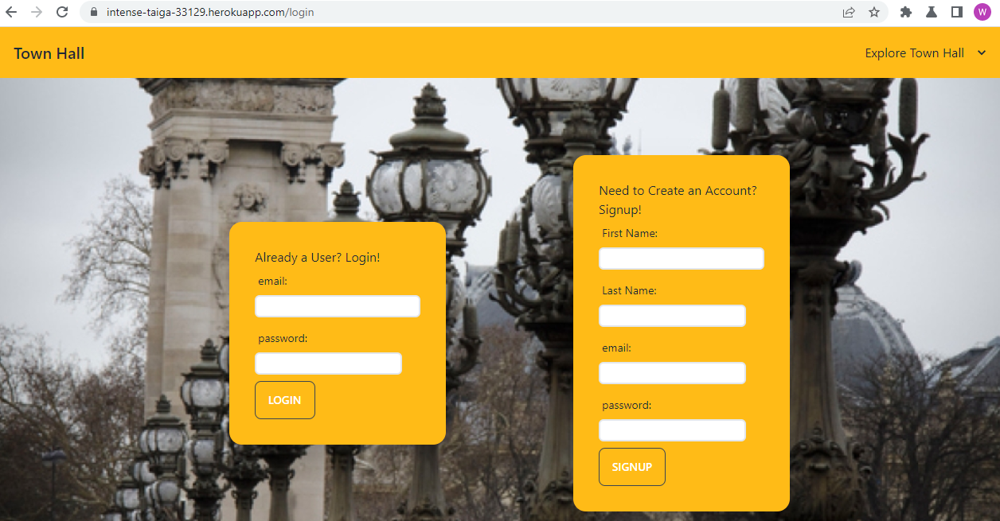

## TOWN HALL
## Description
This application is an interactive and user friendly online Town Hall where the user can create posts and react to posts created by other users. 

## Technologies Used
We used Node.js and Express.js to create a RESTSful API. 
We used Handlebars.js as the templating engine, and we used MySQL and the Sequelize ORM for the database.  For CSS/styling we used Tailwind/daisyUI, and we used placeimg.com for the random image generator.
We used Insomnia to test routes and Workbench to test models, relationships, and queries. We used Github to host our repository and Heroku to deploy our solution.

## Links
Github repository:
https://github.com/tpowers29/Town-Hall
Deployed to heroku:
https://intense-taiga-33129.herokuapp.com/login

## Collaborators
Gwen Paradis -- Design,styling,Responsiveness, Seeds, Handlebars,
Routes,Authentication,Code Clean Up
Whit Spaulding -- Database Design,Models,Relationships,Handlebars, Seeds,Routes
Tyler Powers -- Repo owner, Api Controllers, Models, Authentication, Heroku

## License:
Our github repository is published under the MIT license and we can be reached via email at: 
gwendelynparadis2@gmail.com
tylerpowerst@aol.com
whitspa64@gmail.com 

A screen shot of the deployed application is below:

